<p align="center">
  
</p>

<p align="center">
  
  
  
  
  
</p>

<p align="center">
  <b>Терминальный кодинг-агент со встроенным трекером задач.</b><br />
  План превращается в эпики-фазы и задачи с зависимостями — агент выполняет их по одной и закрывает с отчётом.
</p>

```
alteran                       # терминал (TUI по дизайну Altera)
alteran -p "исправь баги"     # headless-режим
alteran tasks ready           # трекер из консоли (алиас: abr)
```

---

## Чем отличается

**Работа фазами, а не одной большой просьбой.** Claude Code и Codex выполняют задачу целиком и забывают её. Alteran сначала раскладывает план на эпики-фазы и задачи с зависимостями, а затем идёт по ним: `/run-phase 2` не стартует, пока не закрыта первая фаза. Трекер встроен в агента и виден в панели `CONSILIUM` во время работы.

**Совместимость с тем, что уже настроено.** Агенты, команды, скиллы, хуки, права и MCP-серверы подхватываются из Claude Code, Codex, `~/.agents`, Cursor и Gemini — переносить ничего не нужно.

**Формат трекера — [beads](https://github.com/Dicklesworthstone/beads_rust).** Те же `.beads/issues.jsonl`, та же семантика `ready`/`blocked`: `br` в том же каталоге видит ровно те же задачи, и наоборот.

## Установка

```bash
pnpm install
pnpm build
pnpm link --global      # даёт команды `alteran` и `abr`
```

Нужны Node ≥ 22.5 и `ripgrep` (`rg`). Ключ провайдера — в настройках или в переменной окружения (`ANTHROPIC_API_KEY`, `OPENAI_API_KEY`, `OPENROUTER_API_KEY`, `POLZA_API_KEY`). Проверить окружение целиком: `alteran doctor` — провайдеры, модель и маршрут, баланс ключа, трекер, найденные агенты, скиллы, плагины и MCP.

## Рабочий цикл фазами

```
> /plan добавить авторизацию в API          # только чтение, агент исследует код
  … план по фазам → диалог утверждения
  [1] Approve and create phased tasks       # запускается агент create-tasks
> /run-phase 1                              # агент run-phase выполняет и закрывает задачи фазы
> /phases                                   # прогресс по фазам
```

Те же данные доступны из консоли — и из Claude Code через `br`:

```bash
alteran tasks ready            # что можно брать в работу
alteran tasks show alt-x1.2    # описание, критерии приёмки, зависимости
alteran tasks phase 2          # задачи фазы
br ready                       # beads видит ровно те же задачи
```

## Возможности

| | |
| --- | --- |
| **Агент** | цикл модель ↔ инструменты, параллельные read-only вызовы, прерывание по `Esc`, автокомпакция контекста, сессии с `--continue` / `--resume` |
| **Провайдеры** | Anthropic (adaptive thinking, prompt caching), OpenAI Responses API, любые OpenAI-совместимые — OpenRouter, **polza.ai**, Ollama, LM Studio. Модель задаётся как `provider:model` |
| **Трекер CONSILIUM** | эпики-фазы, задачи с критериями приёмки, зависимости (DAG с проверкой циклов), `ready`/`blocked`, комментарии, статистика |
| **Экосистемы** | `~/.claude` и `.claude/` (включая плагины из `installed_plugins.json`), `~/.codex/config.toml`, `skills/`, `prompts/`, `~/.agents/skills`, Cursor и Gemini (`mcp.json`), собственные `~/.alteran` и `.alteran/` |
| **MCP** | stdio / streamable-HTTP / SSE, инструменты `mcp__server__tool`, ресурсы и промпты как slash-команды; при большом числе инструментов схемы грузятся лениво через `ToolSearch` |
| **Права (CLIPEUS)** | режимы `default · acceptEdits · plan · autonomous`, правила в синтаксисе Claude (`Bash(git:*)`, `Edit(src/**)`, `WebFetch(domain:x)`, `mcp__server`); read-only команды разрешаются сами, составная команда — только если разрешены все её части |
| **Хуки** | Claude-формат: `SessionStart`, `UserPromptSubmit`, `PreToolUse`, `PostToolUse`, `Stop`, `SubagentStop`, `PreCompact` |

## Модели и провайдеры

`/model` открывает каталог провайдера: цены за 1M токенов, размер контекста, поиск по строке. Стрелка `→` показывает апстрим-провайдеров выбранной модели — цену, контекст, параметры, хранение данных в РФ — с чекбоксами: `space` отмечает нескольких, порядок отметок задаёт приоритет, `Tab` переключает провайдера. Расход за сессию и баланс ключа видны в нижней строке.

Выбранные провайдеры закрепляются в `routes` и уходят к шлюзу (polza.ai / OpenRouter) **белым списком**: `only` запрещает обслуживать запрос кому-либо вне выбора, `order` задаёт приоритет внутри списка, `allow_fallbacks: false` не даёт выйти за него при ошибке апстрима. То же одной командой: `/model polza:deepseek/deepseek-v4.1-flash@morph/fp8,deepseek` (`@auto` — снять закрепление).

```bash
alteran models polza flash            # каталог с ценами
alteran models polza --routes <model> # кто обслуживает модель и почём
```

## Сессии

Каждый запуск пишется в `~/.alteran/sessions/<проект>/<id>.jsonl`.

```bash
alteran --continue          # продолжить последнюю сессию проекта
alteran --resume            # выбрать сессию из списка при запуске
alteran --resume 3eae13ed   # по префиксу id
alteran sessions            # список сессий: id, время, число сообщений
```

Консоль сразу показывает восстановленную переписку и строку `Resumed session … — N messages restored`; если сессии с таким id нет, агент скажет об этом, а не откроется пустым. Внутри агента то же делает `/resume` — оверлей с поиском и `↑↓`, либо сразу `/resume 3eae13ed`. Продолженная сессия становится текущей: новые ходы дописываются в тот же файл, а не создают форк.

При выходе печатаются готовые к копированию команды — с id именно этой сессии:

```
Session 9830989d saved — 12 messages.

  alteran --resume 9830989d   continue this session
  alteran --resume            pick from 6 older sessions
  alteran sessions            list every session of this project
```

## Интерфейс

**Вход.** Пока грузятся настройки, расширения и MCP-серверы, идёт анимация входа: врата набирают девять шевронов, горизонт событий выбрасывает воронку (та самая «kawoosh»), и вид проваливается сквозь тоннель — после чего появляется интерфейс. Если агент ещё не готов, тоннель продолжает лететь, а не замирает на кадре. Анимация идёт на альтернативном экране и не оставляет следов в прокрутке; отключается `"intro": false` или `ALTERAN_NO_INTRO=1`.

**Стартовый экран** — те же врата: по ободу бежит импульс, шевроны набираются один за другим, внутри дрейфует «пыль». Это только заставка: с первой задачей она замирает и допечатывается в терминал как обычный текст, после чего в простое не перерисовывается ничего. Дальше двигается лишь рабочая анимация — горизонт событий во время прогона и шевроны, отмечающие стадии GRADUS.

**Прокрутка и выделение.** По умолчанию вывод печатается в обычный буфер терминала, как у Claude Code: колесо, выделение мышкой и `Cmd+C` работают штатно — этим занимается сам терминал, а агент в простое не пишет ни байта, поэтому прокрученный вверх экран не дёргается вниз. В режиме с панелями (`Ctrl+B` или `"panels": true`) нужен альтернативный экран: там прокрутка идёт колесом через mouse reporting (шаг — одна строка) или `PgUp`/`PgDn`, а выделение перехватывается — его возвращает `F7` (или `/mouse`). `Ctrl+Y` / `/copy` копируют последний ответ целиком, без мыши: через `pbcopy`/`wl-copy`/`xclip`, а при их отсутствии — через OSC 52 (работает и по SSH).

**Три колонки** (`Ctrl+B`): слева `ASTRIA PORTA` — ASCII-врата, девять шевронов которых и есть конвейер GRADUS (ctx → plan → read → patch → typecheck → tests → lint → self-review → commit), git-статус и рабочее дерево; справа `VIRES` — метрики контекста, график расхода токенов, задачи фазы, журнал событий и состояние прав. При ширине < 158 колонок скрывается левая панель, < 108 — правая.

**Шкала `CONTEXT`** разбита по цветам и символам на то, из чего складывается окно: системный промпт (`#`), инструкции проекта (`$`), каталог агентов и скиллов (`%`), схемы инструментов (`=`), схемы MCP (`~`), переписка (`+`), свободное место (`-`). Полная расшифровка с токенами и процентами — `/context`.

**Нижняя строка:** режим, модель, число инструментов, `BUDGET` — занятый контекст, `SES` — токены и деньги за сессию, `KEY` — остаток и лимит ключа, ветка git.

**Тема:** по умолчанию `dark` — цвета макета, поднятые до контраста ≥ 3:1 (в макете декоративные серые почти сливались с фоном терминала). Есть `contrast` (ещё светлее) и `design` (ровно цвета макета): `"theme": "contrast"` или `ALTERAN_THEME`. Вывод CLI цветной; отключается `--no-color`, `NO_COLOR` или перенаправлением в пайп.

**Клавиши:** `Enter` — отправить, `\`+`Enter` или `Alt+Enter` — перенос строки, `Esc` — прервать, `Shift+Tab` — режим прав, `Ctrl+O` — развернуть вывод инструментов, `Ctrl+B` — панели, `Ctrl+Y` — копировать ответ, `Ctrl+R` — повторить последнюю стадию, `PgUp`/`PgDn` или колесо — прокрутка (с панелями), `F7` — перехват мыши, `F2` diff, `F3` тесты, `F4` фазы, `F5` перезапуск стадии, `?` — помощь.

## Команды

`/help`, `/plan`, `/create-tasks`, `/run-phase N`, `/phases`, `/tasks`, `/mode`, `/iris`, `/model`, `/models`, `/context`, `/copy`, `/bare`, `/mouse`, `/reasoning`, `/compact`, `/clear`, `/resume`, `/mcp`, `/skills`, `/agents`, `/plugins`, `/status`, `/init`, `/diff`, `/exit` — плюс все команды и скиллы, найденные в Claude Code, Codex и плагинах.

CLI: `alteran tasks …`, `alteran models [provider] [фильтр]`, `alteran mcp [list|test]`, `alteran skills|agents|plugins|commands`, `alteran sessions`, `alteran doctor`.

## Настройка

`~/.alteran/settings.json` (глобально) и `.alteran/settings.json` / `settings.local.json` (в проекте):

```json
{
  "model": "polza:deepseek/deepseek-v4.1-flash",
  "smallModel": "polza:deepseek/deepseek-v4-flash",
  "reasoning": "high",
  "routes": { "polza:deepseek/deepseek-v4.1-flash": ["morph/fp8", "deepseek"] },
  "providers": {
    "polza": { "type": "openai-compat", "apiKey": "pza_…" }
  },
  "permissions": {
    "defaultMode": "default",
    "allow": ["Bash(pnpm:*)", "Edit(src/**)"],
    "deny": ["Bash(rm -rf:*)"]
  },
  "theme": "dark",
  "panels": false,
  "mouse": true,
  "intro": true,
  "compat": { "claude": true, "codex": true },
  "mcpServers": { "my-server": { "command": "node", "args": ["server.js"] } }
}
```

## Разработка

```bash
pnpm dev -- -p "привет"    # запуск из исходников
pnpm typecheck
pnpm test                  # 75 тестов: трекер (+ interop с br), права, совместимость,
                           # агентный цикл, каталог моделей, TUI
```

Архитектура — в [ALTERAN.md](ALTERAN.md); макет интерфейса — `design/altera-terminal.html`; герой этого файла собирается скриптом `scripts/hero.ts` в `assets/hero.svg`.
